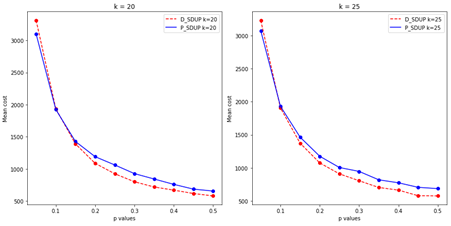

# Energy-Efficient Communication Optimization in Smart Device Networks

This project addresses a graph optimization problem inspired by the paper _"Complexity and Algorithms for Superposed Data Uploading Problem in Networks With Smart Devices"_. The focus is on minimizing energy communication costs between smart devices (SDs) and vehicle base stations (VBSs) using custom implementations of Dijkstra-based and Prim-based algorithms in Python.

## Project Overview


In hazardous environments (e.g., toxic gas leaks), smart devices must transmit data to nearby VBSs efficiently. This scenario is modeled as a **graph optimization problem**, where nodes represent devices and base stations, and weighted edges represent energy communication costs.

The objective is to construct low-cost quasi-trees from SDs to VBSs under capacity constraints. This project implements two algorithms:

- **D-SDUP**: Builds shortest-path communication trees using Dijkstra’s algorithm  
- **P-SDUP**: Combines Prim’s algorithm and Dijkstra to grow optimized subtrees locally then globally

This work not only reproduces the original results but also extends the study by analyzing execution time, which was not addressed in the source paper.


## Repository Structure

'''
- Expermental_setup_1.ipynb: (Scenario 1)experiments varying the communication probability p for different numbers of VBSs (K). 

- Expermental_setup_2.ipynb: (Scenario 2) experiments varying the capacity c for different numbers of VBSs (K). 

- Results_Report.pdf: Full report including methodology, results, and analysis
'''


## Algorithms


### D-SDUP (Dijkstra-Based)
Builds shortest communication paths from SDs to VBSs, assigning them while respecting VBS capacity constraints.

### P-SDUP (Prim-Based)
Uses Prim’s algorithm to build local optimal connections between SDs and VBSs before finalizing paths with Dijkstra.

Both algorithms were implemented entirely from scratch using object-oriented Python for full flexibility.

## Experimental Setup

Two scenarios were implemented to evaluate algorithm performance using n=200 randomly distributed SDs:

## Experimental Setup

Two scenarios were designed to evaluate algorithm performance under varying network conditions:

1. **Scenario 1**: Varying graph edge density, with `p` representing the communication probability between nodes, ranging from `0.05` to `0.50`. The capacity `c` of each VBS is calculated as `n/k`, where `n` is the number of smart devices (SDs).

2. **Scenario 2**: Varying VBS capacity, with values ranging from `10` to `120`, while keeping the communication probability fixed at `p = 0.20`.

In both scenarios, the number of servers `k` was varied in the set `[10, 15, 20, 25]`. Each combination of parameters was tested 100 times for both D-SDUP and P-SDUP algorithms. The study measured both **communication cost** and **execution time** to assess the efficiency and scalability of the algorithms.

## Results

### Cost Comparison  
Both algorithms produced almost similar costs with varying communication probabilities, with D-SDUP slightly outperforming P-SDUP in sparse graphs.





### Execution Time  
P-SDUP showed significantly lower runtime, particularly as density or VBS capacity increased.


### Server capacity Comparison 
P-SDUP becomes increasingly effective under high-density graphs and relaxed capacity constraints.


## Report

The full report includes mathematical formulations, algorithm descriptions, implementation details, and experimental analysis.

[Download the report (PDF)](./Results_Report.pdf)

## How to Run

### Requirements
- Python 3.x
- sys
- random
- time


### Instructions
Open and run the notebooks using Jupyter:
```bash
jupyter notebook Expermental_setup_1.ipynb
jupyter notebook Expermental_setup_2.ipynb
